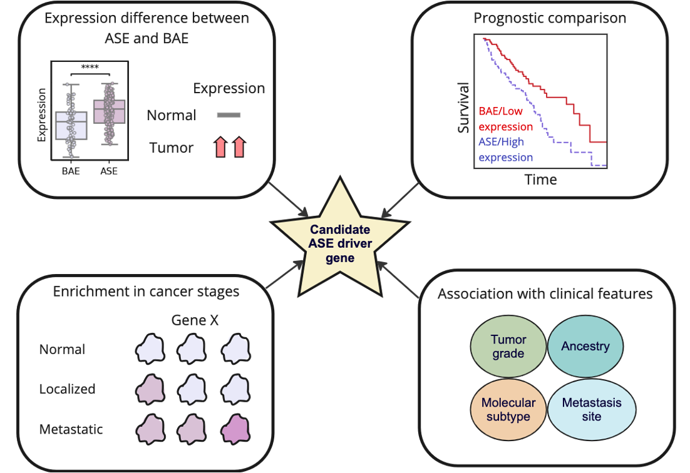

# Cancer ASE driver identification (CASEDI)



CASEDI is an analysis framework that uses tumor allele-specific expression (ASE) data to prioritize cancer driver genes. CASEDI includes functions to identify genes enriched for ASE between datasets, conduct ASE-stratified survival analysis, and identify genes showing ASE outlier expression.

## Installation

The latest stable release can be installed from PyPI:

```python
pip install casedi
```
You may instead want to use the development version from Github:

```python
pip install git+https://https://github.com/maggietsui/CASEDI.git
```

## Usage

Here is a minimal example:

```python
import seaborn as sns
from statannot import add_stat_annotation

df = sns.load_dataset("tips")
x = "day"
y = "total_bill"
order = ['Sun', 'Thur', 'Fri', 'Sat']
ax = sns.boxplot(data=df, x=x, y=y, order=order)
test_results = add_stat_annotation(ax, data=df, x=x, y=y, order=order,
                                   box_pairs=[("Thur", "Fri"), ("Thur", "Sat"), ("Fri", "Sun")],
                                   test='Mann-Whitney', text_format='star',
                                   loc='outside', verbose=2)
test_results
```

More examples are available in the jupyter notebook `example/example.ipynb`.

## Requirements

+ pandas >= 1.3.1
+ numpy >= 1.23.3
+ scikit-survival
+ scipy >= 1.9.1
+ statsmodels >= 0.13.2
